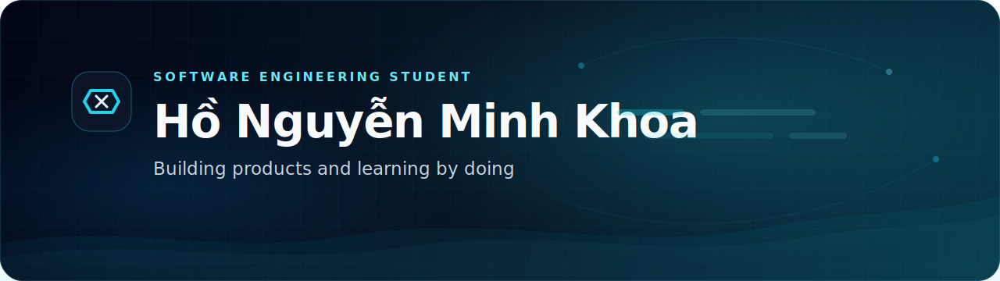

  

# Hi, I'm Minh Khoa 👋

I'm a Software Engineering student who enjoys building things.

Most of what I learn comes from personal projects. I like starting with an idea, turning it into something usable, then gradually improving it through feedback, refactoring, and new requirements.

---

## 🛠 Tech Stack

  
  
  
  
  
  
  

---

## 🚀 Featured Project

###  [GameTopUp](https://github.com/MinhKhoa05/gametopup)

**Intermediary Game Top-Up Operations System**

ASP.NET Core • React • MariaDB • Docker

A long-term project where I explore backend development, frontend experiences, testing, deployment, and product improvements.

🔗 Repository: https://github.com/MinhKhoa05/gametopup

---

## 🌱 Currently Exploring

- Backend development
- Software architecture
- Product design & UX
- Building maintainable systems
- Long-term project development

---

  <i>Keep Learning • Keep Building • Keep Growing</i>

  📧 <a href="mailto:mkhoa639@gmail.com">mkhoa639@gmail.com</a>

